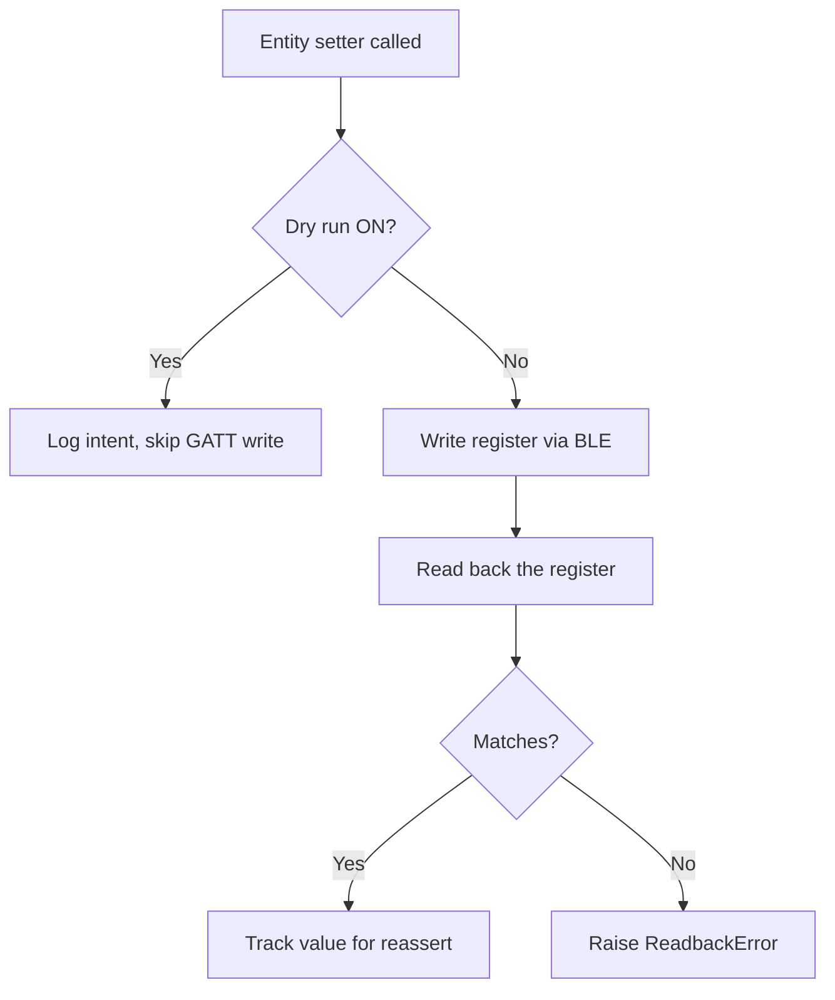

# Deye Bluetooth (Local) — Home Assistant Integration

Local control of a Deye hybrid inverter over **Bluetooth Low Energy**, with **no
cloud dependency**. This integration reads all telemetry and writes all controls
directly to the inverter's logger stick via BLE, using the same Modbus registers
as the Deye Cloud.

## Architecture

```mermaid
graph LR
    subgraph Phone
        A[Deye App]
    end
    subgraph Home Assistant
        B[deye_ble<br/>integration]
        C[ha-deyecloud-bridge<br/>cloud integration]
    end
    D[Logger Stick<br/>BLE service 0x0922]
    E[Inverter<br/>Modbus registers]
    F[Deye Cloud]

    A <-->|BLE exclusive| D
    B <-->|BLE (Modbus over AT)| D
    C -->|MQTT/TLS| F
    F -->|Modbus over MQTT| D
    D ---|Modbus| E
```

> **One BLE central at a time.** The logger stick accepts a single BLE
> connection — the phone Deye app and this HA integration cannot both connect
> simultaneously. Close the Deye phone app before using the BLE integration.

## Running alongside the cloud bridge

This integration is designed to run **in parallel** with
[`ha-deyecloud-bridge`](https://github.com/PetePeter/ha-deyecloud-bridge).
Both report the same telemetry keys with the same scaling — the BLE device is
registered as **"Deye Inverter (BLE)"** (distinct from the cloud bridge's
"Deye Inverter"), so entity IDs and device registry entries never collide.

Use the
[parallel-run validation checklist](docs/validation.md) to compare values
side-by-side and confirm correctness before considering a future switchover.

**No cutover is performed by this integration.** The cloud bridge is left
running and untouched.

## Installation (HACS)

1. Add this repository as a [custom repository](https://hacs.xyz/docs/use/integrations/#add-custom-repositories)
   in HACS → Integrations: the repository URL.
2. Download the integration through HACS.
3. Restart Home Assistant.
4. Go to **Settings → Devices & Services → Add Integration** and search for
   **Deye Bluetooth (Local)**.

## Configuration

The config flow supports two paths:

| Path | Description |
|------|-------------|
| **BLE Discovery** | If the logger is advertising nearby, HA discovers it automatically via service UUID `00000922-...`. Confirm by entering the logger serial number. |
| **Manual** | Pick a discovered BLE device from the list, then enter the logger serial number. |

The **logger serial number** (e.g. `DEYE00000001`) is the BLE advertised name
printed on the logger stick. It becomes the config entry's unique identifier and
drives all entity unique IDs.

### Options (dry-run & reassert)

After setup, **Settings → Devices & Services → Deye Bluetooth (Local) → Options**
exposes two safety toggles:

| Option | Default | Description |
|--------|---------|-------------|
| **Dry Run** | ON | Blocks all GATT writes; logs what *would* be written. No values are sent to the inverter. |
| **Reassert** | OFF | If a cloud/app write changes a register that HA last set, re-apply the HA value on the next poll cycle. |

## Safety model

Writes to a live inverter are inherently risky. This integration uses a layered
approach:



1. **Dry-run default** — all writes are blocked until the user explicitly
   disables dry-run in the integration options. This means the integration
   installs as **read-only** by default.
2. **Read-back verify** — every write is followed by an immediate register
   read. If the read-back doesn't match, a `ReadbackError` is raised and the
   optimistic entity update is reverted.
3. **Opt-in reassert** — when enabled, the coordinator detects if a tracked
   control register has drifted (e.g. the cloud bridge or phone app changed
   it) and re-applies the last HA-set value.

## Entities

### Sensors (21 + 1 derived)

| Key | Name | Unit | Source register |
|-----|------|------|-----------------|
| `solar_power` | Solar Power | W | `0x02A0` |
| `house_load` | House Load | W | `0x0283` |
| `grid_power` | Grid Power | W | `0x025F` |
| `battery_power` | Battery Power | W | `0x024E` |
| `ups_power` | UPS Power | W | `0x028D` |
| `battery_soc` | Battery SOC | % | `0x024C` |
| `battery_voltage` | Battery Voltage | V | `0x024B` |
| `battery_temp` | Battery Temperature | °C | `0x024A` |
| `inverter_temp` | Inverter Temperature | °C | `0x021D` |
| `daily_solar` | Solar Today | kWh | `0x0211` |
| `daily_grid_import` | Grid Import Today | kWh | `0x0208` |
| `daily_grid_export` | Grid Export Today | kWh | `0x0209` |
| `total_solar` | Solar Total | kWh | `0x0216` |
| `total_grid_import` | Grid Import Total | kWh | `0x020A` |
| `total_grid_export` | Grid Export Total | kWh | `0x020C` |
| `total_battery_charge` | Battery Charge Total | kWh | `0x0204` |
| `total_battery_discharge` | Battery Discharge Total | kWh | `0x0206` |
| `max_sell_power` | Max Sell Power | W | `0x008F` |
| `inverter_power_l1` | Inverter Output L1 | W | `0x0279` |
| `inverter_power_l2` | Inverter Output L2 | W | `0x027A` |
| `inverter_power_l3` | Inverter Output L3 | W | `0x027B` |
| `daily_consumption` | Consumption Today | kWh | derived from `0x020F` |

### Controls

| Platform | Entity | Register | Description |
|----------|--------|----------|-------------|
| `number` | Max Sell Power | `0x008F` | Grid export power limit (0–15 000 W) |
| `number` | Charge Target SOC | `0x00A7` | Battery charge cutoff (%) |
| `select` | Work Mode | `0x008E` | Selling First / Zero Export to Load / Zero Export to CT |
| `time` | Grid Charge Start | `0x0095` | Charge window start time |
| `time` | Grid Charge End | `0x0096` | Charge window end time |

### Intentionally not implemented

| Entity | Reason |
|--------|--------|
| `binary_sensor.grid_connected` | No verified BLE register for grid-connection state |
| `discharge_soc` | No verified register for discharge cutoff SOC |
| Grid voltages L1–L3 | Registers exist (`0x0258`/`0x0273`–`0x0275`) but scaling not confirmed against live values |

## Protocol

See [`docs/protocol.md`](docs/protocol.md) for the full reverse-engineered BLE
framing specification (AT commands, Modbus wrapping, CRC, register map).

## Credits

Protocol reverse-engineered from a cloud TLS/MQTT MITM capture and an Android
BLE HCI snoop. Built with Claude Code.
