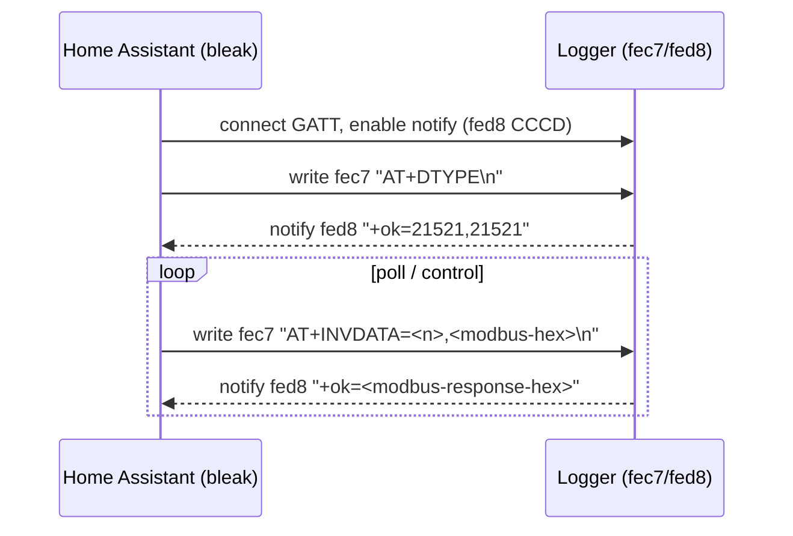

# Deye Bluetooth (Local) — Home Assistant Integration

Local control of a Deye hybrid inverter over **Bluetooth LE**, with **no cloud
dependency**. This is a drop-in replacement for the cloud-polling
[`ha-deyecloud-bridge`](https://github.com/PetePeter/ha-deyecloud-bridge):
same entities, but read and written directly to the inverter's logger stick over
BLE.

## Why

The Deye app's "local mode" talks to the logger over BLE, wrapping Modbus frames
in simple AT commands. We reverse-engineered that protocol (see
[`docs/protocol.md`](docs/protocol.md)) and can now read all telemetry and write
controls locally — independent of Deye Cloud, internet, or the logger's MQTT
uplink.

## Status

Work in progress. See the build plan (helm plans P0–P6).

## Protocol summary

- **Write** char: `0000fec7` (Write Request — *with* response)
- **Notify** char: `0000fed8` (CCCD `0x0019`)
- **Read**: Modbus func `0x03` wrapped as `AT+INVDATA=8,<frame>`
- **Write**: Modbus func `0x10` wrapped as `AT+INVDATA=11,<frame>`

## Key registers

| Register | Entity | Notes |
|----------|--------|-------|
| `0x008E` | Work Mode | `0`=Selling First, `1`=Zero Export to Load, `2`=Zero Export to CT |
| `0x008D` | Solar Sell | on/off flag (normally 1) |
| `0x008F` | Max Sell Power | watts, 1:1 |
| `0x0094..0x0099` | TOU slot times | decimal HHMM (`0x044C`=1100=11:00) |
| `0x009A..0x009F` | TOU slot power | W |
| `0x00A6..0x00AB` | TOU slot SOC | % |
| `0x00AC..0x00B1` | TOU grid-charge | on/off per slot |
| `0x0085` (+blocks) | Telemetry | battery/grid/solar/load/power/energy |

Full map: [`docs/protocol.md`](docs/protocol.md).

## Configuration

Config flow asks for:

- **Logger serial number** (the BLE advertised name, e.g. `DEYE00000001`) —
  configurable; the integration discovers the matching BLE device.
- Poll interval.

## Credits

Protocol reverse-engineered from a cloud MITM capture and an Android BLE HCI
snoop. Built with Claude Code.
