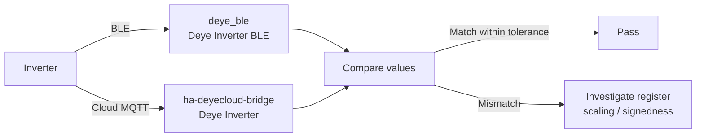

# Parallel-Run Validation Checklist

Run `deye_ble` and `ha-deyecloud-bridge` side by side, then compare entity
values to confirm the BLE integration reports correct data. **Do not disable or
remove the cloud bridge** — switchover is a separate future task.

## Validation flow

## Entity comparison table

Compare each `sensor.deye_inverter_ble_*` against the corresponding
`sensor.deye_inverter_*` from the cloud bridge. Record the values at the same
time (or within a few seconds for fast-changing power values).

### Telemetry sensors (read)

| BLE entity key | Cloud bridge entity | Tolerance | Notes |
|---|---|---|---|
| `solar_power` | `sensor.deye_inverter_solar_power` | ±50 W | Fast-changing; sample at same second |
| `house_load` | `sensor.deye_inverter_house_load` | ±50 W | Fast-changing; sample at same second |
| `grid_power` | `sensor.deye_inverter_grid_power` | ±50 W | Fast-changing; signed (negative = export) |
| `battery_power` | `sensor.deye_inverter_battery_power` | ±50 W | Fast-changing; signed (negative = charging, positive = discharging) |
| `ups_power` | `sensor.deye_inverter_ups_power` | ±50 W | Fast-changing |
| `battery_soc` | `sensor.deye_inverter_battery_soc` | **exact** | Slow-changing; should match precisely |
| `battery_voltage` | `sensor.deye_inverter_battery_voltage` | ±0.5 V | Slow-changing |
| `battery_temp` | `sensor.deye_inverter_battery_temperature` | ±1.0 °C | Slow-changing |
| `inverter_temp` | `sensor.deye_inverter_inverter_temperature` | ±1.0 °C | Slow-changing |
| `daily_solar` | `sensor.deye_inverter_solar_today` | **exact** | Accumulates during the day |
| `daily_grid_import` | (no direct cloud counterpart) | — | Cloud reports `daily_consumption` instead |
| `daily_grid_export` | (no direct cloud counterpart) | — | Cloud bridge does not expose daily grid export separately |
| `total_solar` | `sensor.deye_inverter_solar_total` | **exact** | Lifetime total; should match precisely |
| `total_grid_import` | `sensor.deye_inverter_grid_import_total` | **exact** | Lifetime total |
| `total_grid_export` | `sensor.deye_inverter_grid_export_total` | **exact** | Lifetime total |
| `total_battery_charge` | `sensor.deye_inverter_battery_charge_total` | **exact** | Lifetime total |
| `total_battery_discharge` | `sensor.deye_inverter_battery_discharge_total` | **exact** | Lifetime total |
| `max_sell_power` | `number.deye_inverter_max_sell_power` | **exact** | Control register read-back |
| `inverter_power_l1` | `sensor.deye_inverter_inverter_power_l1` | ±50 W | Fast-changing |
| `inverter_power_l2` | `sensor.deye_inverter_inverter_power_l2` | ±50 W | Fast-changing |
| `inverter_power_l3` | `sensor.deye_inverter_inverter_power_l3` | ±50 W | Fast-changing |

### Derived sensor

| BLE entity key | Cloud bridge entity | Tolerance | Notes |
|---|---|---|---|
| `daily_consumption` | `sensor.deye_inverter_consumption_today` | ±0.5 kWh | BLE derives this from the lifetime `total_consumption` register (`0x020F`) minus a midnight baseline, mirroring the cloud bridge's logic |

### Controls (write-then-read)

| Control | Register | Steps |
|---|---|---|
| Work Mode | `0x008E` | Set via cloud → read via BLE; set via BLE → read via cloud |
| Max Sell Power | `0x008F` | Same cross-check as Work Mode |
| Charge Target SOC | `0x00A7` | Same cross-check |
| Charge Start/End | `0x0095` / `0x0096` | Same cross-check |

### Intentionally not validated

| Entity | Reason |
|---|---|
| `binary_sensor.grid_connected` | Cloud bridge exposes this; no verified BLE register exists |
| `discharge_soc` | No confirmed register for discharge cutoff SOC |

## Validation steps

1. **Install** both integrations. Confirm both appear in
   **Settings → Devices & Services** with distinct device names
   ("Deye Inverter" for cloud, "Deye Inverter (BLE)" for BLE).
2. **Close the Deye phone app** to free the BLE connection.
3. **Wait one full poll cycle** (default 5 minutes) for the BLE integration to
   populate all sensor values.
4. **Snapshot** both integrations' states (e.g. via `/api/states` or a
   dashboard screenshot) within a few seconds of each other.
5. **Compare** each row in the table above. Mark pass/fail.
6. **For fast-changing power values**, take multiple snapshots at different
   times of day (sunny morning, midday peak, evening idle) to build confidence.
7. **For controls**, test with dry-run ON first (confirm no GATT writes), then
   disable dry-run and test one control at a time with read-back verification.
